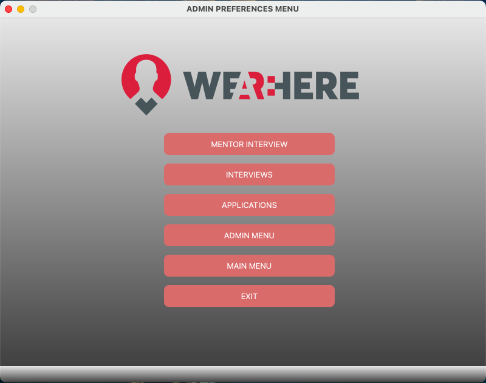
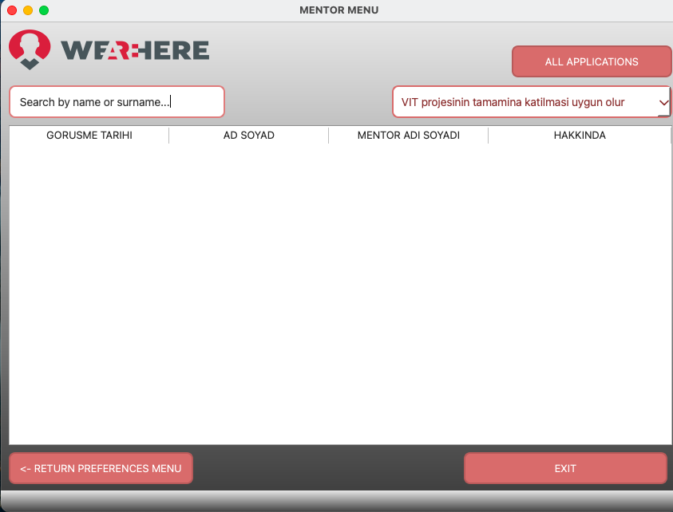
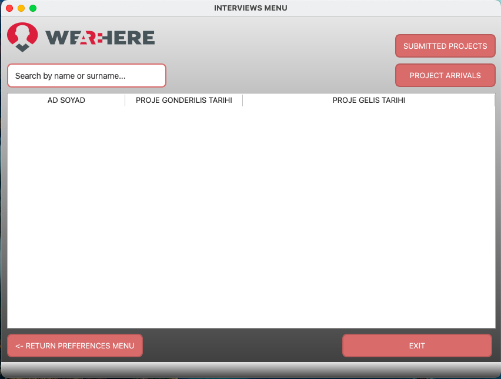

# 🖥️ CRM Project (Customer Relationship Management)

A simple CRM application to manage users, mentors, interviews, and preferences with a **custom login system**.  
All user data is stored in the **Users file** (linked to Google Drive main Gmail account).

---

## 🚀 Features

### 🔑 Login System
- Users must login with credentials registered by the main Gmail account.
- **Admin users** → redirected to **Preferences - Admin**.
- **User users** → redirected to **Preferences**.
- Custom login page includes:
  - Two input fields for **username** and **password**
  - **Login button** that validates credentials
  - **Warning text** for failed login attempts
  - Optional **close button** to exit the application
  - Custom styling: colors, fonts, button hover/press effects, rounded edges

### 📂 User Management
- Users file stores all login credentials and authorities
- Admin can manage users via **Preferences - Admin** menu

  

### 🧑‍🏫 Mentor Management
- Add, edit, and list mentors
- Separate menu available for mentor operations (**mentor_menu.py**)

### 📝 Interview & Application Management
- Manage interviews via **interview_menu.py**
- Manage applications via **applications.py**
- Separate UI files for screens (`.ui`) make the app visually appealing

     

### 🎨 Customization
- Login and menu windows have consistent styling:
  - Background colors
  - Fonts and text colors
  - Button shapes and effects
  - Optionally remove the window image (`logo.png`)

---

## 📂 Project Files

| File | Description |
|------|-------------|
| `login.py` / `login.ui` | Login screen and UI layout |
| `admin_menu.py` / `admin_menu.ui` | Admin menu functionality and UI |
| `preferences.py` / `preferences.ui` | User preferences screen |
| `preferences_admin.py` / `preferences_admin.ui` | Admin preferences screen |
| `mentor_menu.py` / `mentor_menu.ui` | Mentor management screen |
| `interview_menu.py` / `interview_menu.ui` | Interview management screen |
| `applications.py` / `applications.ui` | Application management screen |
| `logo.png` | App logo used in screens |

---

## 🛠️ Requirements
- Python 3.x
- `tkinter` for GUI
- `json` for data storage

